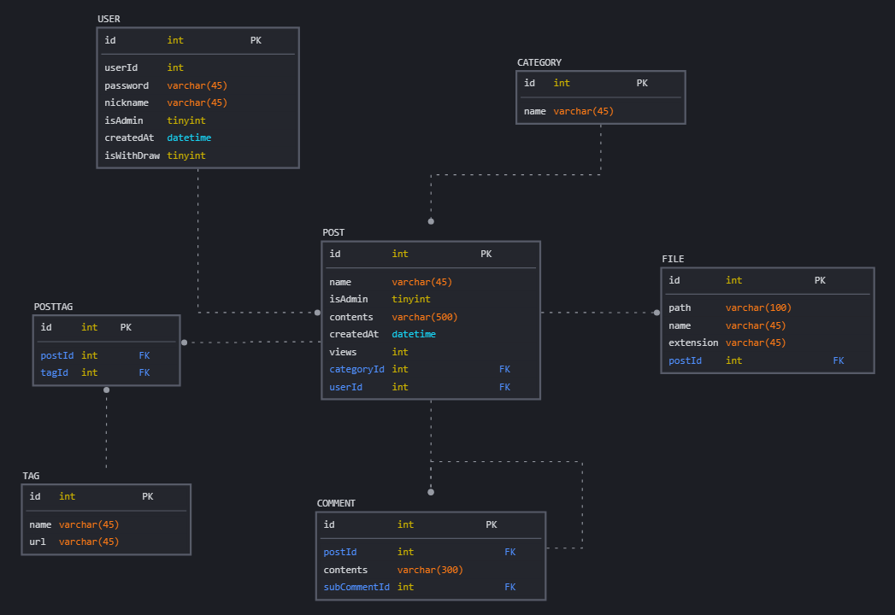

# board-traffic

게시판 프로젝트 (진행중)

## 목적

* Kotlin 연습
* 대용량 트래픽을 고려한 애플리케이션 개발
* 객체지향과 가독성을 고려한 코드 작성

## 사용 기술

* OpenJDK 17
* Spring Boot 3.2.1
* Spring Data JPA
* QueryDsl
* MySQL
* Redis

## 주요 기능

* 회원
  * 가입, 탈퇴
  * 아이디 및 닉네임 중복 체크
  * 비밀번호 암호화
  * 로그인, 로그아웃
* 게시판
  * 카테고리 관리
    * 추가, 수정, 삭제
  * 게시글 관리
    * 게시글/파일/태그/댓글 조회, 추가, 수정, 삭제

## ERD

